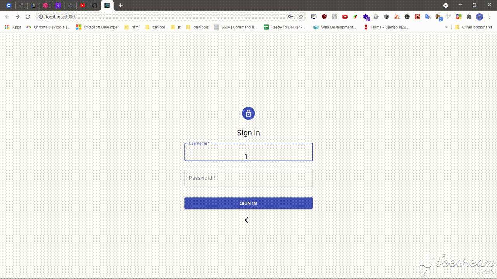

# Simple Authentication System

  	
Site Gifs

  
  - 
  - 
  - 

-----

API

- ### /auth

  - POST: /signin
  
    - with json {username, password}
---    
    
  - POST: /signup
  
    - with json {username, password, email}
---

- ### /admin

  - GET : /user
    - return a list of all the users in the database
---
  - GET : /user/{id}
    - return the user with this specific  id
---
  - POST : /user/create
    - create a new user
      - `need to autherized (send the token in the header)`
      - `send the user as Json object`
        - `{username, email, password}`
---
  - PUT : /user/edit/{username}
    - edit an existing user
      - `need to autherized (send the token in the header)`
      - `send the user as Json object`
        - `{username, email, password}
---
  - DELETE : /user/delete/{username}
    - `need to autherized (send the token in the header)`
    - delete the user with the username

------

---

How to lunch the app

### dependencies
- postgresql
- nodeJs (npm)
---
### steps
1. start the backend server 
  - import the backend into intellij 
    - change the database url, username, and password
      - you will need `postgresql`
  - lunch the app 

2. start the React app in the frontend
  - run `npm install`

